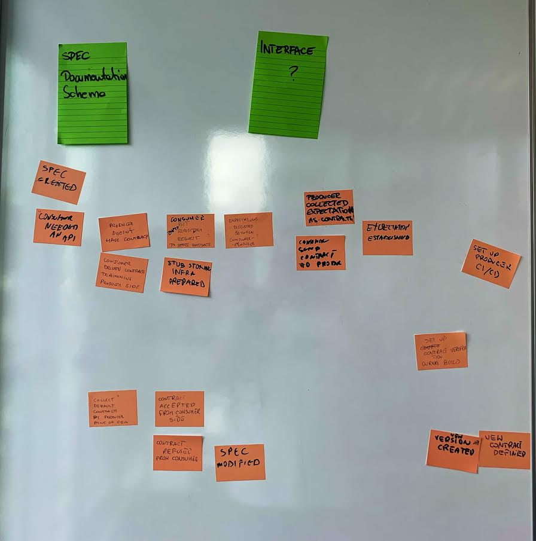
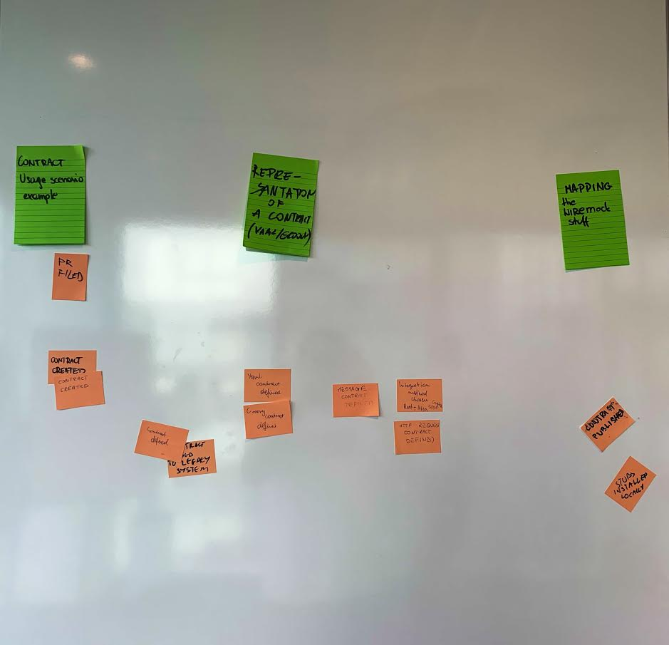
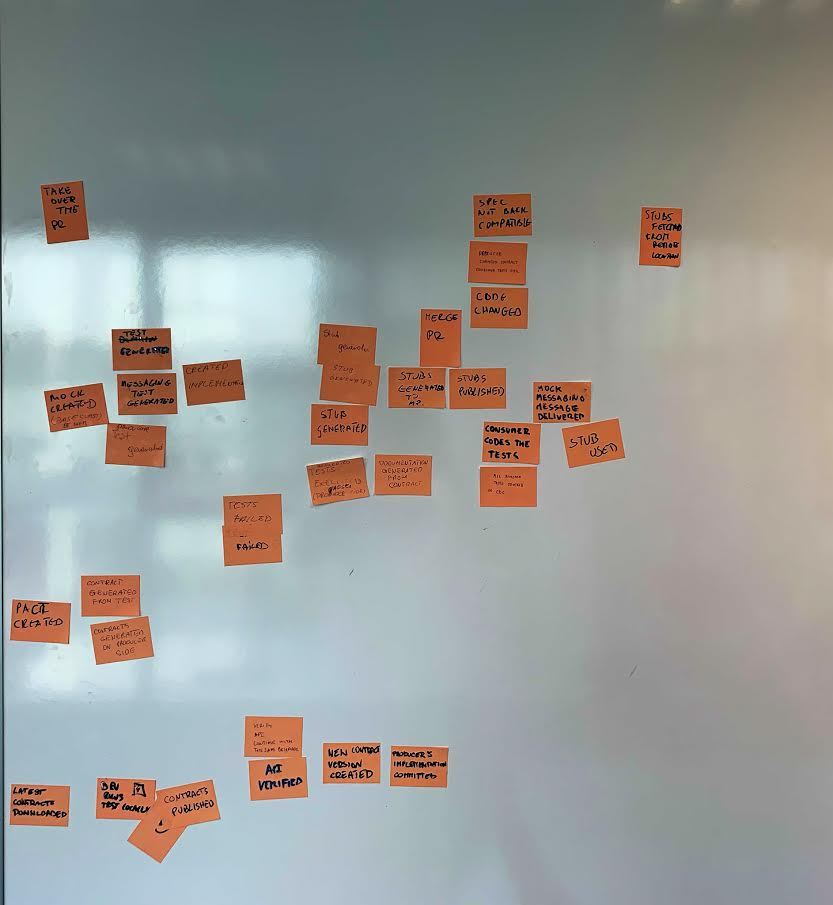
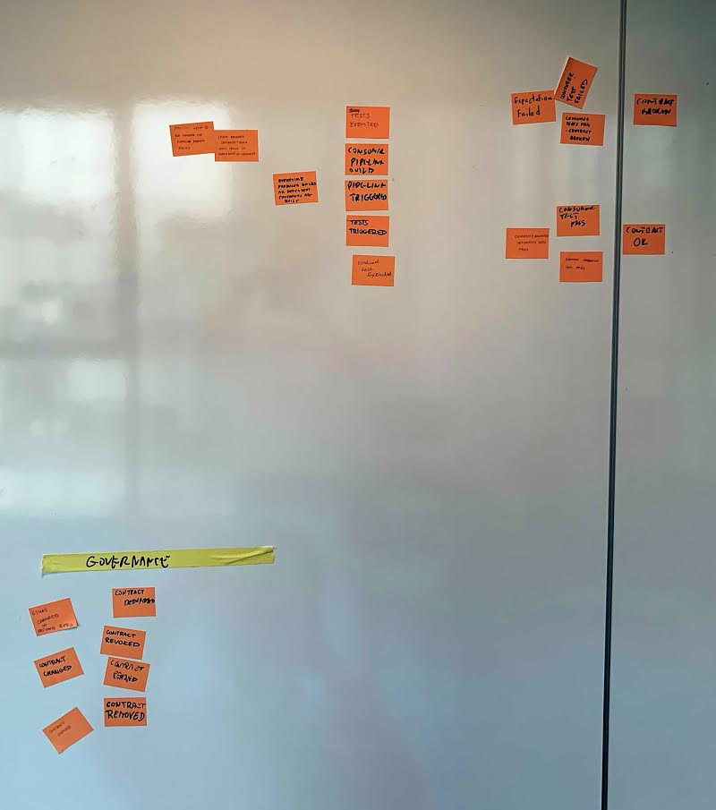

# Spring Cloud Contracts
A documentation from Spring Cloud Contract with another perspective

## Specificacion

**Context:**
Spring Cloud Contracts help any Spring Development with the usage of Contract Driven Development. This solution could be used in 2 different was: 

- Producer approach: The API/Event System provides a set of Expections (Stable set of behaviour of the artifacts) stored.
- Consumer approach: The consumer uses contracts from producers in the Integration Tests and stablish a set of organizational mechanism to maintain the contracts. Using this approach, any Consumer can deliver with more confident because it doesn't need to wait in any 

## References

https://github.com/spring-cloud/spring-cloud-contract
https://github.com/spring-cloud-samples/spring-cloud-contract-samples

