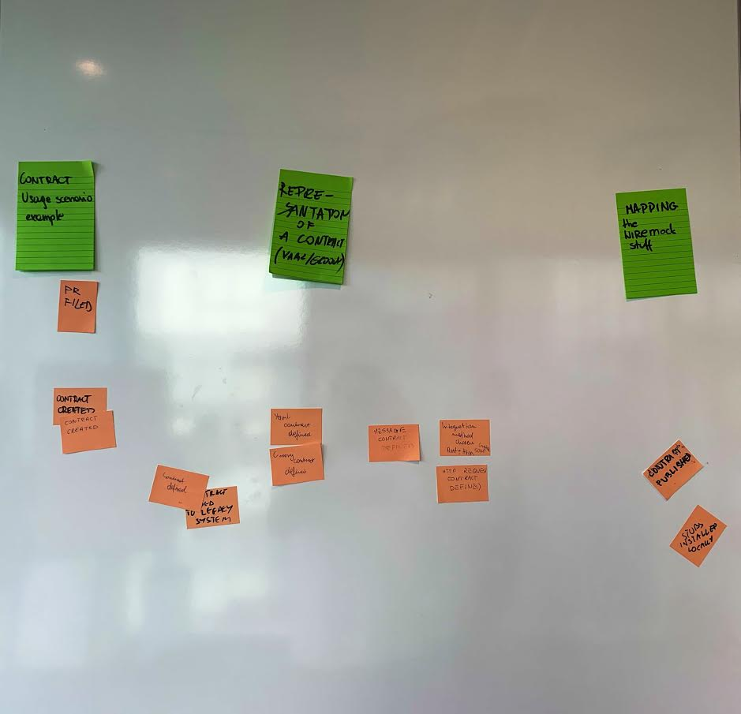

# The contract Definition

## Producer

- Evaluate if your project is Legacy or not
- Define contracts for the mayority of Expectations
- Implements the contracts in YAML or JSON
- Publish the contracts
- Create a Pipeline to verify the Contracts with the component
