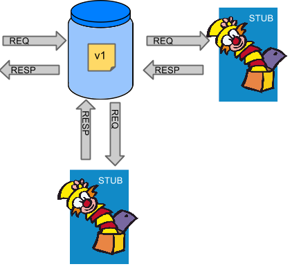

# The problem to solve

When you have a project with multiple dependencies like the scenario provided in the following diagram:

It not possible to wait for all dependencies in an environment to execute your Integration tests. It is necessary to provide a solution with the goal to put that tests in daily Developer activities.

